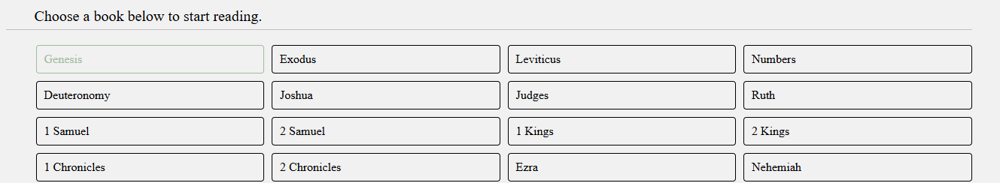
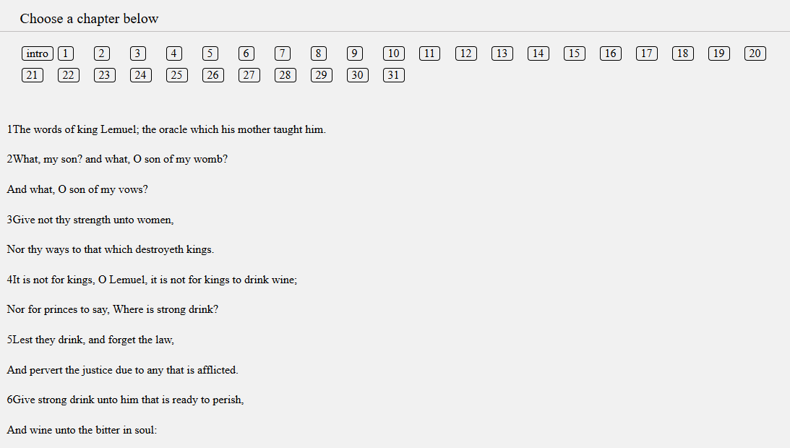

# DREAM - Digital Prayer Board and Bible

## Overview

- What is Dream?
- Technologies & Techniques Utilized
- Explore the Site
- Upcoming Features

## What is DREAM?

DREAM is a digital platform designed to support believers in
their prayer life through a digital prayer board.

Inspired by prayerful women in the Bible; Deborah, Ruth, Esther, Anna, and Mary, DREAM gives provides a community integrated system allowing users to share prayers and pray for others as well.

## Technologies & Techniques Utilized

The current version of DREAM utilizes frontend technologies & techniques to display the starting foundation of the app.

### Frontend Frameworks & Build Tools

- React
- Vite
- React Router DOM
- JSX
- HTML
- CSS

### State Management

In order to properly call and display prayer cards and a fully functional Bible, react hooks, context API, and localStorage is utilized. These management tools create a seamless users experience through the consistent calling of contexts and data.

### Fully functional Bible through API Integration

DREAM allows users to have access to the Bible throught the use of [API.Bible](https://scripture.api.bible/)

Image of a list of Bible books

Vanilla Fetch is used to generate books, chapters, and verses. HTML/CSS is utilized to neatly present the API response and display information in a manageable format.

Image of verses being rendered for Proverbs 31

The Bible API used requires developers to integrate FUMS (File Usage Management System) to track what the API is being utilized for, ensuring integrity in its design.

### Responsive UI

All components inside of dream has a responsive design, allows users across multiple screen resolutions to utilize the app. The desgin can generously accommodate screens ranging from 517px to 1440px

## Explore the site

[Click here](https://acozycoder.github.io/dream_board/) to explore the DREAM site. Once there, you can create an account and add prayers to the community board!

## Upcoming features

Users can expect the following features to be implemented in later verisons of DREAM:

- Profile implementation - Users will be able to create an account and gain access to a personal profile.

- Privacy - Users will have the ability to mark prayers as private, creating a seperation of community and personal prayers.

- Community overhaul - The community board will only display public prayers. Users will be able to show support through a praying button.

- Prayer tracking - Users will be able to mark prayers as "answered", creating a fully functional digital prayer board.

- Prayer editing and deletion - Users will be able to edit or delete prayers.

- Verse of the day - The homepage will display a verse of the day.
